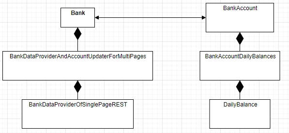

# resttest
Hello!  Thanks so much for taking the time to look at this sample code and give it a good critique - I'm looking forward to learning from your feedback.  The current implementation was completed in C# using .net core 3.1, and has been tested both on an AWS 2 Linux AMI and a Win10 client.  I have a root directory hierarchy defined to allow me to create implementations across multiple languages, although I haven't yet had time to experiment in writing these (Go, Java, Python).

## Prerequisites
1. Dotnet core 3.1 https://dotnet.microsoft.com/download/dotnet-core/3.1

## Build and Test Instructions
1. Clone this repo ( ```git clone https://github.com/collinroth/resttest.git``` )
1. ```cd resttest/C#```
1. ```dotnet build```
1. ```dotnet test```
1. ```dotnet run --project src/restTest/restTest.csproj```

As an alternative to using the dotnet CLI, you can also cd into ```resttest/C#/src/restTest/bin/Debug/netcoreapp3.1``` and start ```restTest``` from the command line.


## External Opensource Dependencies
1. xunit for unit testing

## Subdirectory Layout

|base directory|subdirectory|Description|
|---|---|---|
|/resttest/C#/|/src|Source files|
||/tests|XUnit tests|
||||
|/resttest/C#/src|/restTest|Small main executable source file that drives into the RestTest.Banking logic|
||/RestTest.Banking|Assembly (library) where the logic is stored|
||||
/resttest/C#/src/RestTest.Banking|/Implementations|Classes defining the logic of the program|
||/Interfaces|Abstract interfaces that the above classes will implement|
||||
|/resttest/C#/tests|/RestTest.Banking.Tests|Unit tests for the main logic classes|
||/jsonTestFiles|Helper files for unit testing containing sample data|

## Assumptions / Clarifications yet to be made
1. Transactions dates may not be sequential
1. Transactions for a given day may be sparsely located (on different pages)
1. Some dates may have no transactions
1. There may be large date gaps where there are no transactions
1. There may be a very large number of transactions on a single page
1. There may be a very large number of pages
1. Insertion of pages into an Account for DailyBalance calculations doesn't strictly need to be done in linear order.  As described below in the Design/Performance section, I have enabled overlapping page retrieval and DailyBalance insertion.  For example, Page 3 may be processed before Page 2 depending on processor and page circumstances (e.g. Page 2 having a huge number of transactions, and Page 3 having only a few).

## Design Goals
My design goals were:
1. Focus on specific what I was asked to deliver - YAGNI.  
    * Specifically, while I was tempted to persistently store the actual transactions, this wasn't in the requirements so I avoided it.  Instead, I stream  each transaction into its aggregated DailyBalance calculation and then toss it away.  But if the requirement to store individual transactions, it's easy to see where they would live.
1. Avoid over-cooking with complexity.  With that said, the primary areas that I couldn't avoid were:
    * The integration of a page with a batch of transactions into the ```BankAccountDailyBalances.cs```
    * The orchestration of retrieving the pages and then driving them into an Account (see ```BankDataProviderAndAccountUpdaterForMultiPages.cs```)
1. If a class structure was low-cost, and felt like it was a reasonable frame for the future, then I kept it.  
    * For example, I imagine that you may have multiple Banks, with various modes of retrieving their transactions, against customers who may have multiple accounts, etc.  This framing is pretty light right now.
1. Build for performance.  Particularly my focus was on two areas:
    * Streaming the HTTP in a way that didn't require a sequential 'full retrieval and storage of the REST results' before processing them.  Instead, the Headers are retrieved and then we start to stream the results into a JSON deserializer - resulting in a lower memory footprint and hopefully faster processing since we allow some JSON deserialization in parallel with the socket I/O that happens concurrently.
    * I am overlapping the page retrieval socket I/O with the insertion/processing of the previous page's transactions into the account's DailyBalance.  This will again provide for some level of parallelism.

A simple class diagram:



## Configuration
Would love to have pulled any configuration out into a YAML file.  Minimally, what I'd want to put in there:
* Each Bank(s) URL(s)
* The socket timeouts
* Logfile location
* Any limits on the amount of concurrency that we want to bound ourselves to

## Logging
Would love to add logging.  Still to-do.

## Error Handling
I'm not in love with a network request failing without giving the user enough information to understand that the environment is broken, and how it is broken.  So, I made the decision to wrap up any HTTP or JSON deserialization failures with enough descriptive info (URL, operation, etc) the raw text returned into the Exception.  This is a trade-off for me, because I imagine that some results returned from the Bank may be quite sensitive.  It is likely too noisy for the command line usage, and should be put into a log.  For now, I lent towards "information exposure in favour of ease-of-error-resolution".

## Expected Build Output
```
$ dotnet build
Microsoft (R) Build Engine version 16.5.0+d4cbfca49 for .NET Core
Copyright (C) Microsoft Corporation. All rights reserved.

  Restore completed in 51.92 ms for /home/ec2-user/git/resttest/C#/tests/RestTest.Banking.Tests/RestTest.Banking.Tests.csproj.
  Restore completed in 0.69 ms for /home/ec2-user/git/resttest/C#/src/restTest/restTest.csproj.
  Restore completed in 0.38 ms for /home/ec2-user/git/resttest/C#/src/RestTest.Banking/RestTest.Banking.csproj.
  RestTest.Banking -> /home/ec2-user/git/resttest/C#/src/RestTest.Banking/bin/Debug/netstandard2.0/RestTest.Banking.dll
  restTest -> /home/ec2-user/git/resttest/C#/src/restTest/bin/Debug/netcoreapp3.1/restTest.dll
  RestTest.Banking.Tests -> /home/ec2-user/git/resttest/C#/tests/RestTest.Banking.Tests/bin/Debug/netcoreapp3.1/RestTest.Banking.Tests.dll

Build succeeded.
    0 Warning(s)
    0 Error(s)

Time Elapsed 00:00:01.51
```
## Expected Unit Test Output
```
$ dotnet test
Test run for /home/ec2-user/git/resttest/C#/tests/RestTest.Banking.Tests/bin/Debug/netcoreapp3.1/RestTest.Banking.Tests.dll(.NETCoreApp,Version=v3.1)
Microsoft (R) Test Execution Command Line Tool Version 16.5.0
Copyright (c) Microsoft Corporation.  All rights reserved.

Starting test execution, please wait...

A total of 1 test files matched the specified pattern.

Test Run Successful.
Total tests: 61
     Passed: 61
 Total time: 3.5366 Seconds
```
## Expected Execution Output
```
$ ./restTest
2013-12-12 -227.35
2013-12-13 -1456.93
2013-12-15 -1462.32
2013-12-16 -6037.85
2013-12-17 4648.43
2013-12-18 2807.14
2013-12-19 22560.45
2013-12-20 18505.85
2013-12-21 18487.87
2013-12-22 18377.16
```
